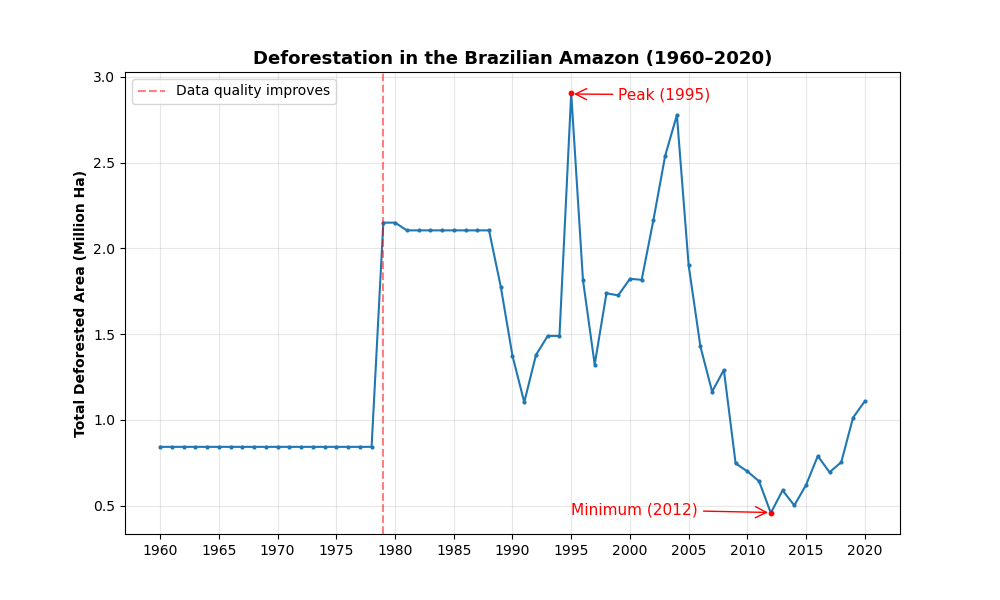
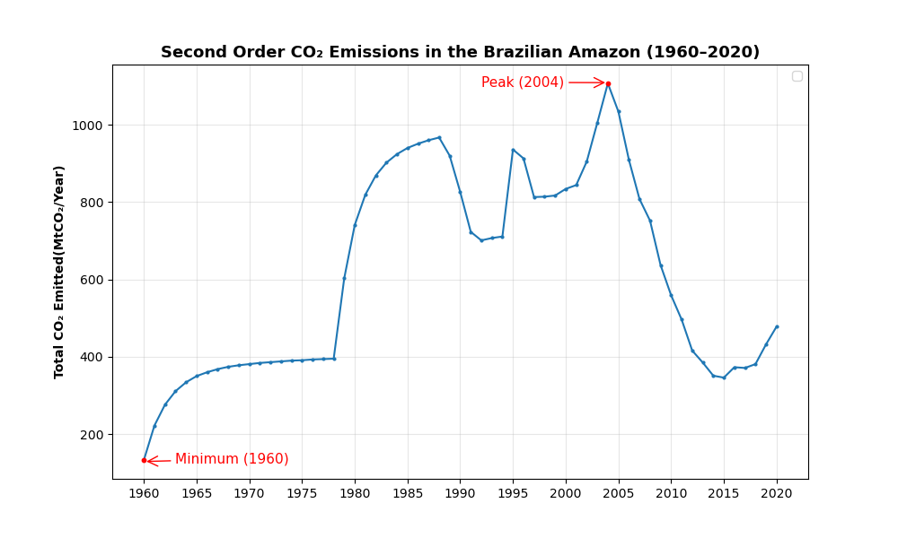
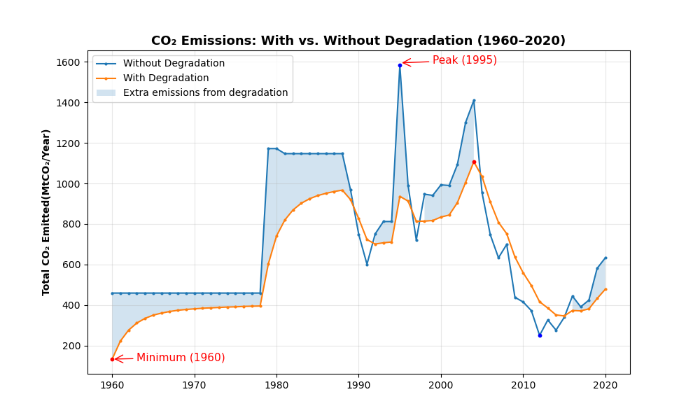
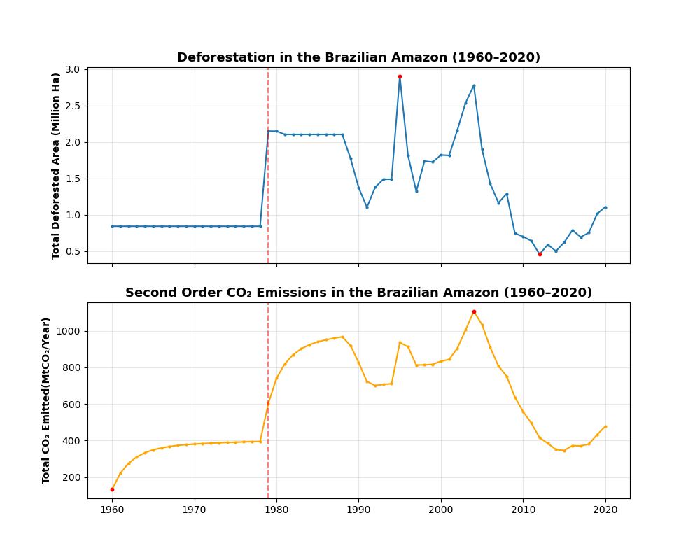

# 🌍 Análise de Emissões de CO₂ e Desmatamento na Amazônia

<p align="center">
  <a href="README.md">🇺🇸 English</a> •
  🇧🇷 Português
</p>

---

## 📌 Visão Geral
Este projeto analisa como o desmatamento na Amazônia influencia diretamente as emissões de CO₂ ao longo das décadas, destacando como modelos tradicionais subestimam o impacto ambiental ao ignorar a degradação florestal.

A análise utiliza dados já processados que consideram dois cenários:
- Modelo de primeira ordem (sem degradação)
- Modelo de segunda ordem (com degradação)

O objetivo é entender como a degradação ambiental intensifica as emissões.

---

## 📂 Dados

Os dados utilizados neste projeto são provenientes do Instituto Nacional de Pesquisas Espaciais (INPE), por meio do sistema de estimativas de emissões brutas da Amazônia:

🔗 https://inpe-em.ccst.inpe.br/emissoes-brutas-amz/

### 📊 Informações incluídas:
- Emissões de CO₂ associadas ao desmatamento
- Estimativas considerando degradação florestal
- Séries temporais históricas da Amazônia brasileira

### 🧭 Observações:
- Os dados representam **emissões brutas**, ou seja, não consideram a remoção de carbono pela vegetação
- A metodologia é baseada em modelagem científica desenvolvida pelo INPE
- Podem existir diferenças em relação a outras bases de dados (ex: SEEG)

---

## ⚙️ Como a análise foi construída

- Separação dos dados em cenários com e sem degradação  
- Agrupamento por ano  
- Comparação entre diferentes modelos de emissão  
- Identificação de valores extremos  
- Visualização dos resultados  

---

## 📊 Resultados e Visualizações

---

### 🔹 Desmatamento ao longo do tempo

Este gráfico mostra a evolução do desmatamento na Amazônia ao longo dos anos, considerando apenas áreas sem degradação.

<details>
  <summary>💻 Código: (clique para expandir)</summary>

```python
# Filtrar dados (sem degradação)
df_without_degradation = filter_without_degradation(df)

# Agrupar desmatamento por ano
df_grouped_deforestation_without_degradation = aggregation_deforestation(df_without_degradation)

# Encontrar valores máximos e mínimos
max_year_deforestation_without_degradation, max_value_deforestation_without_degradation, min_year_deforestation_without_degradation, min_value_deforestation_without_degradation = extremes_deforestation_without_degradation(df_grouped_deforestation_without_degradation)

# Gerar gráfico
plot_graphic_deforestation_without_degradation(
    df_grouped_deforestation_without_degradation,
    max_year_deforestation_without_degradation,
    max_value_deforestation_without_degradation,
    min_year_deforestation_without_degradation,
    min_value_deforestation_without_degradation
)
```
</details>

---

🖼️ Gráfico:



---

📊 Análise:

O gráfico mostra que o desmatamento cresce de forma consistente até a década de 1990, atingindo seu pico nesse período. Esse comportamento sugere uma fase de intensa expansão da atividade econômica na região, com forte pressão sobre a floresta.

A partir dos anos 2000, observa-se uma tendência de redução, que se torna mais evidente após 2010. Essa queda pode estar associada à implementação de políticas públicas mais rigorosas de controle ambiental, monitoramento por satélite e fiscalização mais efetiva.

Além disso, a presença de picos e quedas acentuadas ao longo da série sugere que o desmatamento não ocorre de forma estável, mas responde a fatores externos como mudanças econômicas, políticas governamentais e pressão internacional.

No geral, o gráfico evidencia não apenas a magnitude do desmatamento ao longo do tempo, mas também a influência direta de ações humanas e institucionais sobre a dinâmica ambiental da Amazônia.

---

### 🔹 Emissões de CO₂ com degradação (segunda ordem)

Este gráfico apresenta as emissões de CO₂ ao longo do tempo considerando a degradação ambiental, utilizando o modelo de segunda ordem.

<details>
  <summary>💻 Código: (clique para expandir)</summary>

```python
# Filtrar dados (com degradação)
df_with_degradation = filter_with_degradation(df)

# Agrupar emissões por ano
df_grouped_carbon_emission_with_degradation = aggregation_carbon_emission_with_degradation(df_with_degradation)

# Encontrar valores máximos e mínimos
max_year_carbon_emission_with_degradation, max_value_carbon_emission_with_degradation, min_year_carbon_emission_with_degradation, min_value_carbon_emission_with_degradation = extremes_carbon_emission_with_degradation(df_grouped_carbon_emission_with_degradation)

# Gerar gráfico
plot_graphic_carbon_emission_with_degradation(
    df_grouped_carbon_emission_with_degradation,
    max_year_carbon_emission_with_degradation,
    max_value_carbon_emission_with_degradation,
    min_year_carbon_emission_with_degradation,
    min_value_carbon_emission_with_degradation
)
```
</details>

---

🖼️ Gráfico:



---

📊 Análise:

As emissões de CO₂ apresentam um padrão de crescimento ao longo do tempo, com destaque para picos associados a períodos de maior atividade de desmatamento.

Por considerar a degradação ambiental, esse modelo captura impactos mais amplos do que apenas a remoção direta da vegetação. Isso resulta em valores mais realistas de emissão.

A variação ao longo dos anos indica que as emissões não dependem apenas da área desmatada, mas também da intensidade da degradação e das condições ambientais. Esse comportamento reforça a importância de modelos mais completos para análise climática.

---

### 🔹 Comparação de emissões (com vs sem degradação)

Este gráfico compara as emissões de CO₂ considerando dois cenários: com e sem degradação ambiental, permitindo visualizar o impacto adicional da degradação.

<details>
  <summary>💻 Código: (clique para expandir)</summary>

```python
# Agrupar emissões sem degradação
df_grouped_carbon_emission_without_degradation = aggregation_carbon_emission_without_degradation(df_without_degradation)

# Agrupar emissões com degradação
df_grouped_carbon_emission_with_degradation = aggregation_carbon_emission_with_degradation(df_with_degradation)

# Encontrar extremos (sem degradação)
max_year_carbon_emission_without_degradation, max_value_carbon_emission_without_degradation, min_year_carbon_emission_without_degradation, min_value_carbon_emission_without_degradation = extremes_carbon_emission_without_degradation(df_grouped_carbon_emission_without_degradation)

# Encontrar extremos (com degradação)
max_year_carbon_emission_with_degradation, max_value_carbon_emission_with_degradation, min_year_carbon_emission_with_degradation, min_value_carbon_emission_with_degradation = extremes_carbon_emission_with_degradation(df_grouped_carbon_emission_with_degradation)

# Gerar gráfico comparativo
plot_graphic_comparison_carbon_emission(
    df_grouped_carbon_emission_without_degradation,
    max_year_carbon_emission_without_degradation,
    max_value_carbon_emission_without_degradation,
    min_year_carbon_emission_without_degradation,
    min_value_carbon_emission_without_degradation,
    df_grouped_carbon_emission_with_degradation,
    max_year_carbon_emission_with_degradation,
    max_value_carbon_emission_with_degradation,
    min_year_carbon_emission_with_degradation,
    min_value_carbon_emission_with_degradation
)
```
</details>

---

🖼️ Gráfico:



---

📊 Análise:

A comparação entre os dois cenários evidencia claramente o impacto da degradação ambiental nas emissões de CO₂. Em todos os períodos, o modelo com degradação apresenta valores superiores ao modelo sem degradação.

A área entre as curvas representa emissões adicionais que não seriam capturadas por um modelo simplificado. Isso mostra que considerar apenas o desmatamento direto leva a uma subestimação significativa do impacto ambiental.

Essa diferença se torna mais relevante em períodos de maior atividade, indicando que a degradação intensifica ainda mais os efeitos das mudanças no uso da terra.

---

### 🔹 Desmatamento vs emissões

Este gráfico apresenta, em subplots, a relação entre o desmatamento e as emissões de CO₂ ao longo do tempo, permitindo comparar visualmente a evolução das duas variáveis.

<details>
  <summary>💻 Código: (clique para expandir)</summary>

```python
# Agrupar desmatamento
df_grouped_deforestation_without_degradation = aggregation_deforestation(df_without_degradation)

# Agrupar emissões com degradação
df_grouped_carbon_emission_with_degradation = aggregation_carbon_emission_with_degradation(df_with_degradation)

# Encontrar extremos do desmatamento
max_year_deforestation_without_degradation, max_value_deforestation_without_degradation, min_year_deforestation_without_degradation, min_value_deforestation_without_degradation = extremes_deforestation_without_degradation(df_grouped_deforestation_without_degradation)

# Encontrar extremos das emissões
max_year_carbon_emission_with_degradation, max_value_carbon_emission_with_degradation, min_year_carbon_emission_with_degradation, min_value_carbon_emission_with_degradation = extremes_carbon_emission_with_degradation(df_grouped_carbon_emission_with_degradation)

# Gerar gráfico combinado
plot_graphic_deforestation_carbon_emission(
    df_grouped_deforestation_without_degradation,
    max_year_deforestation_without_degradation,
    max_value_deforestation_without_degradation,
    min_year_deforestation_without_degradation,
    min_value_deforestation_without_degradation,
    df_grouped_carbon_emission_with_degradation,
    max_year_carbon_emission_with_degradation,
    max_value_carbon_emission_with_degradation,
    min_year_carbon_emission_with_degradation,
    min_value_carbon_emission_with_degradation
)
```
</details>

---

🖼️ Gráfico:



---

📊 Análise:

A comparação entre desmatamento e emissões de CO₂ revela uma relação consistente entre as duas variáveis ao longo do tempo. Períodos de aumento no desmatamento tendem a coincidir com elevação nas emissões.

No entanto, a relação não é perfeitamente linear, o que indica a presença de outros fatores influenciando as emissões, como degradação, tipo de vegetação e intensidade das queimadas.

Essa análise reforça que o desmatamento é um dos principais agentes das emissões na Amazônia, mas não o único, destacando a complexidade do sistema ambiental.

---

## 🚀 Como executar

Clone o repositório, entre na pasta e execute:

    git clone https://github.com/RuyMachado/amazon-deforestation-carbon-emissions.git
    cd amazon-deforestation-carbon-emissions
    pip install -r requirements.txt
    python main.py

---

## 🛠️ Tecnologias utilizadas

- Python  
- Pandas  
- Matplotlib  

---

## 📌 Conclusão

Os resultados demonstram que a degradação florestal exerce um impacto significativo nas emissões de CO₂, frequentemente subestimado por modelos simplificados.

A comparação entre os cenários evidencia que:

- Modelos sem degradação subestimam as emissões reais
- A relação entre desmatamento e CO₂ é forte, mas não linear
- Políticas públicas e fatores externos influenciam diretamente os padrões observados

Esses achados reforçam a necessidade de abordagens mais completas na modelagem climática e no desenvolvimento de estratégias ambientais.

Além disso, os resultados destacam o papel crítico da Amazônia no equilíbrio climático global e a importância de políticas ambientais eficazes.

---
